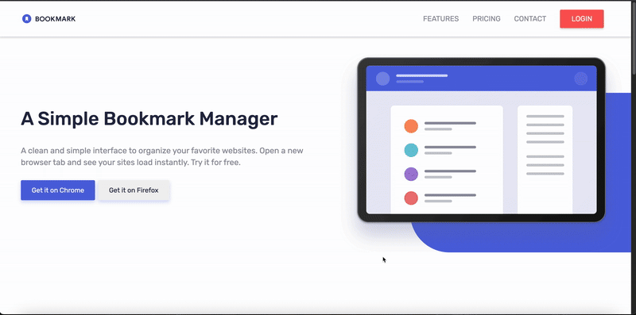

# Angular Clone - Bookmark

## 📓 Introduction
This Exercise is about learning how to use Angular framework and clone a website [https://bookmarkextension.vercel.app/] achieving the same functionality and most similar UI utilizing Angular toolkit.

## ✅ Goals

* Learn how to use Angular framework basic tools
* Learn about the Angular CLI
* Learn about routing and navigation in Angular SPA system
* Learn Angular data binding
* Recreate the UI of the [https://bookmarkextension.vercel.app/] website
* Components and atomic design patterns
* Responsive design
* Form validation through template-driven approach
* Testing with Karma and Jasmine

## 🚀 Getting started

```sh
git clone https://github.com/JungleGiu/Angular-clone.git
cd Angular-clone
npm install   # or: yarn install, or: pnpm install
npm start     # or: yarn start, or: pnpm start
```

## 🧪 Testing
Note : **Testing is still incoplete**
if you want to run the tests
```sh
npm test      # or: yarn test, or: pnpm test
```

## Preview



## 📁 Folder structure
```
.
├── .gitignore
├── .editorconfig
├── tsconfig.app.json
├── tsconfig.json
├── tsconfig.spec.json
├── README.md
├── angular.json
├── package.json
├── pnpm-lock.yaml
├── angular
├── .vscode
├── dist
├── node_modules
├── public
│   └── Images
└── src
    ├── app
    │   ├── app.config.ts
    │   ├── app.html
    │   ├── app.routes.ts
    │   ├── app.scss
    │   ├── app.spec.ts
    │   ├── app.ts
    │   ├── hooks
    │   │   ├── mobile-menu.ts
    │   │   ├── mobile-menu.spec.ts
    │   │   ├── observer.spec.ts  
    │   │   └── observer.ts
    │   ├── components
    │   │   ├── download-card
    │   │   │   ├── download-card.html
    │   │   │   ├── download-card.spec.ts
    │   │   │   ├── download-card.scss
    │   │   │   └── download-card.ts
    │   │   ├── features-card
    │   │   │   ├── features-card.html
    │   │   │   ├── features-card.spec.ts
    │   │   │   ├── features-card.ts
    │   │   │   └── features-card.scss
    │   │   ├── features-nav
    │   │   │   ├── features-nav.html
    │   │   │   ├── features-nav.spec.ts
    │   │   │   ├── features-nav.ts
    │   │   │   └── features-nav.scss
    │   │   ├── text-content
    │   │   │   ├── text-content.html
    │   │   │   ├── text-content.spec.ts
    │   │   │   ├── text-content.ts
    │   │   │   └── text-content.scss  
    │   │   ├── footer
    │   │   │   ├── footer.html
    │   │   │   ├── footer.spec.ts
    │   │   │   ├── footer.ts 
    │   │   │   └── footer.scss
    │   │   └── header
    │   │       ├── header.html
    │   │       ├── header.spec.ts       
    │   │       ├── header.ts
    │   │       └── header.scss
    │   ├── home
    │   │   ├── home.html
    │   │   ├── home.spec.ts
    │   │   ├── home.ts
    │   │   └── home.scss
    │   └── sections
    │       ├── download
    │       │   ├── download.html
    │       │   ├── download.spec.ts
    │       │   ├── download.ts
    │       │   └── download.scss
    │       ├── faq
    │       │   ├── faq.html
    │       │   ├── faq.spec.ts
    │       │   ├── faq.ts
    │       │   └── faq.scss
    │       ├── features
    │       │   ├── features.html
    │       │   ├── features.spec.ts
    │       │   ├── features.ts
    │       │   └── features.scss
    │       ├── hero
    │       │   ├── hero.html
    │       │   ├── hero.spec.ts
    │       │   ├── hero.ts
    │       │   └── hero.scss
    │       └── newsletter
    │           ├── newsletter.html
    │           ├── newsletter.spec.ts
    │           ├── newsletter.ts
    │           └── newsletter.scss
    │       
    ├── main.ts
    ├── index.html
    └── styles.scss 

```

## 🧰 Tecnologies used
- Angular 20
- TypeScript
- SASS (SCSS)
- pnpm
- Karma
- Jasmine

## ☑️ To Do
- [X] Use Angular toolkit
- [X] Routing and navigation using Angular's router
- [X] Clone the design
- [X] Use atomic design principles to structure the code
- [X] Responsive design using media queries
- [X] Validate form fields
- [X] gitflow workflow
- [X] Add animations
- [ ] Implement unit tests and e2e tests